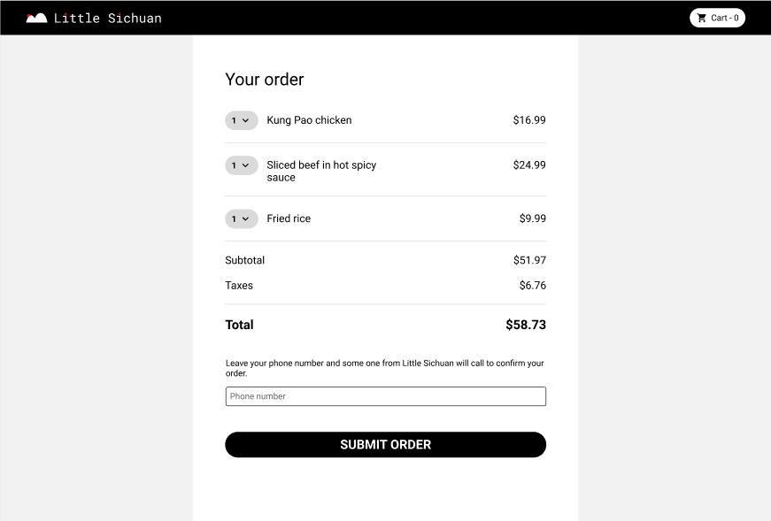

# LittleSichuan – Online Family Kitchen Platform
A fully-featured and responsive web application that allows home-based chefs to list traditional Sichuan dishes and customers to browse, order, and track meals. This was a full-stack solo project inspired by the idea of supporting local family chefs and delivering authentic food experiences through a modern, easy-to-use interface.

# Demos
### Main Page

### Checkout Page

# Design
The LittleSichuan platform was designed with a focus on simplicity, responsiveness, and clear separation of concerns between frontend and backend.
The frontend is built with [**React.js**](#React.js), styled using [**MUI**](#MUI) (Material UI) and custom inline/CSS module styles. The design follows a clean, modern look inspired by real-world food delivery platforms.
React Router enables a single-page application experience, and Context API is used to manage global state (such as cart contents) across pages.
On the backend, a [**Node.js**](#Node.js) + [**Express.js**](#Express.j) server handles all API endpoints. [**TypeORM**](#TypeORM) connects to a [**MySQL**](#MySQL) database and abstracts entity relationships.
All communication between frontend and backend is handled through Axios.

# Features
### User-Facing
- Product Browsing Page — View all available homemade dishes.
- Cart and Checkout — Add items to cart, modify, and submit orders.
- Order Status Tracking — Check the status of placed orders.
- Search Functionality — Find dishes by keyword.
- Responsive Design — Optimized for desktop and mobile.

### Admin/Chef-Facing
- Product Management: Add/edit/delete dishes.
- Order Handling Page: View incoming orders and update statuses.
- Database-Backed Dashboard — Store and retrieve order and product data.

# Contribution
This was a solo project where I built both the frontend and backend from scratch.
I was responsible for:
- Designing and implementing the database schema with TypeORM.
- Building React pages with fully functional UI and cart logic.
- Implementing the checkout system and order persistence.
- Creating RESTful APIs for product and order management.
- Styling with responsiveness in mind using MUI and raw CSS.

